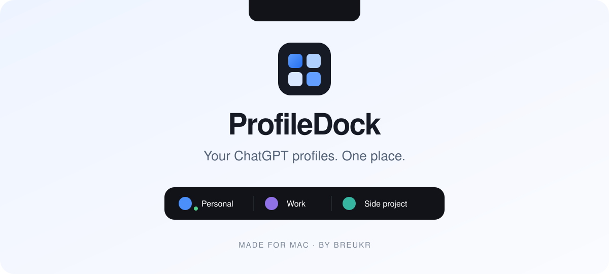

<p align="center"><picture><source media="(prefers-color-scheme: dark)" srcset="docs/hero-dark.svg"></picture></p>

<p align="center">
  <a href="https://github.com/breukr/profiledock/releases/latest">Download for Mac</a> ·
  <a href="#install-with-an-agent">Install with an agent</a> ·
  <a href="#how-it-works">Quick guide</a> ·
  <a href="https://github.com/breukr/profiledock/issues">Feedback</a> ·
  <a href="https://github.com/sponsors/breukr">Sponsor</a>
</p>

ProfileDock puts your ChatGPT and Codex profiles within reach on every screen. Hover to switch accounts, check usage, see unread Work results, and find out when saved resets expire.

**Free. Open source. Mac-native. Made by [Breukr](https://github.com/breukr).**

- **One home for your accounts.** Create profiles and Finder launchers; switch with a click or ⌥⌘1–9.
- **Experimental native Dock icons.** Opt in per profile to a local ChatGPT copy with its own name and colored icon. See [tradeoffs and setup](docs/NATIVE-DOCK.md).
- **ChatGPT updates on your terms.** Select all app groups or just the ones you can restart. Separate copies update independently.
- **At a glance.** Colored activity dots, brief completion/input cues beside the notch, and optional quiet chimes.
- **Monochrome app icon.** Choose Auto, Dark, Light, Tinted or Clear; Auto follows the native macOS icon appearance.
- **Fits your Mac.** Use the notch/menu bar, or drag a floating launcher anywhere on each display. Keep the notch free for other apps. Tiles adapt into rows, with pages for more accounts.
- **Saved resets, explained.** Expand the resets row for an oldest-first expiry countdown.
- **See your activity over time.** Expand Usage insights for tokens, API-equivalent estimates, and session activity. Compare Today, 7 days, or 30 days for one account or all local profiles.

Requires **macOS 14+**, an **Apple Silicon Mac (M1 or newer)**, and the **current [ChatGPT desktop app](https://chatgpt.com/download/)**. ChatGPT Classic is not supported. ProfileDock does not include or redistribute ChatGPT. Intel Macs can use the older v1.0.1 release; new releases target Apple Silicon.

## Install

Download **ProfileDock.zip** from [Releases](https://github.com/breukr/profiledock/releases/latest), unzip it, and move **ProfileDock.app** to Applications. Open it, click **Add profile**, and sign in when you open your new profile.

### Install with an agent

Paste this into a local coding agent with terminal access:

> Install ProfileDock from https://github.com/breukr/profiledock. Read its README and installation script first. Use the latest official release, verify its SHA-256 checksum and macOS signature, and install it in Applications. If no signed release is available, build it locally from source. Keep my existing ChatGPT profiles, chats, and credentials intact. Open ProfileDock when ready; I will sign in myself.

### Install through Terminal

Download the installer, inspect it, then run it:

```sh
curl -fL https://raw.githubusercontent.com/breukr/profiledock/main/scripts/download-install.sh -o /tmp/profiledock-install.sh
less /tmp/profiledock-install.sh
bash /tmp/profiledock-install.sh
```

To build locally instead, install Xcode 26 or newer and select its developer tools, then:

```sh
git clone https://github.com/breukr/profiledock.git
cd profiledock
./scripts/build-app.sh
./scripts/install-app.sh
open /Applications/ProfileDock.app
```

The build creates an Apple Silicon app. Local builds use a local signature; published downloads are signed and notarized.

## How it works

1. **Add a profile**, then open it and sign in to ChatGPT.
2. **Hover at the top center** of any screen. Click a profile or press ⌥⌘1–9.
3. **Expand Resets** for expiry countdowns. Blue means working, orange means waiting for you, red means unread results.
4. **Choose ChatGPT updates** in Settings. Shared profiles update together; separate app copies can update independently.

A profile's options menu lets you change its picture, create a Finder launcher or app copy, and remove it. Data stays on your Mac by default. **Appearance** includes startup at login and display sizing.

**ChatGPT updates** show download progress and can be cancelled before installation. **ProfileDock updates** check daily while running, with a prompt before downloading or installing. Only ProfileDock restarts. Version 1.0.x users need to install this release manually once.

In **Appearance**, choose **Top center** or **Free position**. Drag the grip to move a floating strip; each display remembers its position. Hover over the rest to open your profiles. You can preview activity cues and enable optional chimes. Blue means working, orange needs input, green is idle, red is unread, and gray is closed or unknown. Old activity detected at startup stays quiet. An optional macOS Dock icon opens settings on click.

Choose your app icon under **Settings → Appearance**. [Icon appearance details](docs/ICON-APPEARANCES.md).

[Full guide](docs/GUIDE.md) · [Privacy & security](PRIVACY.md)

**Usage insights** opens with a click, on hover, or by default when the strip expands. Choose its behavior from the drawer's menu or **Settings → Usage insights**. Switch the chart between cost, tokens, and sessions. Estimates use local session history and published Standard API rates, not your subscription bill. [How it is calculated](docs/INSIGHTS.md).

ProfileDock’s own Dock and menu-bar icons have independent visibility settings under the **Settings** tab. Opening Settings shows a native top-left **ProfileDock** menu with separate companion and ChatGPT/Codex update commands. When persistent Dock visibility is off, its icon appears only while Settings is open.

**Context tagging** lets one profile find earlier local Work/Codex conversations in source profiles you enable. Open **Settings → Context tagging**, choose the profile you work in, enable its sources, and select **Connect**. Start a new task, type `@`, and select a profile from the desktop chat's skill suggestions. Profile names and plain-text `@aliases` also work. A local search preview shows passages with their original profile, conversation, and date. Sharing is directional and off by default. [Setup, scope, and privacy](docs/CONTEXT.md).

Activity covers local Work/Codex tasks. Profiles are not a security boundary, and OpenAI's desktop interfaces may change. ProfileDock never redeems reset credits. It is independent of OpenAI.

## Support

If ProfileDock helps, [make a one-time donation](https://github.com/sponsors/breukr?frequency=one-time) or [sponsor development monthly](https://github.com/sponsors/breukr). Choose any amount on GitHub Sponsors. Contributions help fund maintenance, bug fixes, and improvements. Every feature stays free and open source.

In the app, choose **Support ProfileDock…** from the ProfileDock menu or right-click its menu-bar icon. **Settings → Support** also offers one-time and monthly contributions.

You can also **[give it a star](https://github.com/breukr/profiledock)**, share it, or [contribute](CONTRIBUTING.md).

## Development

```sh
swift test
./scripts/build-app.sh
```

Swift, SwiftUI, AppKit, and [Sparkle](https://sparkle-project.org/) for updates. See [release notes](docs/RELEASING.md) for signing and notarization. [MIT licensed](LICENSE); chimes are [CC0](Resources/Sounds/LICENSE.md), and third-party acknowledgments are in [THIRD_PARTY_NOTICES.md](THIRD_PARTY_NOTICES.md).
