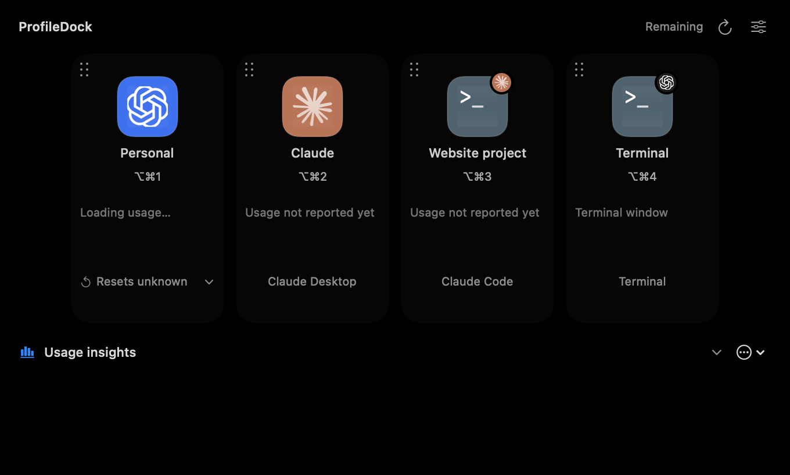

# Claude and Terminal

Coding terminals are discovered automatically, even before any terminal profile has been saved. The strip has a collapsible **Terminals** section with a refresh button. **Profiles → Terminal connector** controls automatic discovery and expansion. Only detected entries disappear when their sessions close; manually saved projects remain available in settings.

Add Claude Desktop, a Claude Code project, or an Apple Terminal tab from **Profiles → Add Profile → App**. These entries share the strip, colors, custom artwork, keyboard shortcuts, Finder shortcuts and ordering with Codex profiles.

Only open Terminal tabs with a foreground Claude Code or Codex process appear in the strip or terminal suggestions. Idle shells, stopped/background agents and closed tabs are excluded. A small circular agent logo on the upper-right corner of the Terminal icon identifies the active tool, including when it changes in the same tab. Detection reads process executable names, TTYs and foreground state, never command arguments or terminal contents. The picker refreshes while open and revalidates a selection before saving it.

Saved projects remain in Profiles settings so they can be reopened. Hidden terminals do not consume strip space or keyboard shortcuts. Order is stored independently of visibility. Codex terminal support covers detection, branding and window control; per-tab Codex CLI activity/usage is unavailable rather than borrowed from an unrelated desktop account.

Drag the dotted handle on a tile or profile row to reorder it. A floating card follows the pointer, the original fades, and an insertion line indicates before/after the highlighted destination. Escape cancels. Reduced Motion disables movement animations. The new order is saved when you drop; cancelling or dropping outside keeps the old order. Hover over the page arrows while dragging to reach another page. Move earlier/later actions remain available through the tile menu and accessibility actions.

## Grid layout

Use the grid icon in the expanded strip to choose Automatic or set your own Columns and Rows. **Settings → Appearance → Grid layout** exposes the same controls with a visual preview. Dimensions mean columns × rows per page, with 1–12 of each. The choice persists across restarts and applies to both the apps and terminal sections, which have independent page controls.

The same grid menu and Appearance settings include independent **Terminals** and **Usage Insights** switches. Turning a section off removes its heading, content and reserved space from the notch; it keeps connection settings, analytics history and saved expansion choices. Hidden terminals do not consume notch shortcuts.

Custom layouts size the panel width from the column count. Tall pages scroll inside the screen; small displays reduce the effective column count so tiles stay readable. Extra profiles are paged, and empty rows are not reserved when fewer profiles are present. Returning to Automatic restores the saved automatic-width settings. Reordering and keyboard shortcuts keep profile identity through layout changes.

## Windows

- Claude Desktop uses the existing installed app and sign-in. Opening it restores its window.
- A Terminal entry points to a specific tab using its window ID, TTY and Terminal process start time. Reused identifiers after a restart cannot select an unrelated tab.
- Choose an existing tab while adding an entry, or choose a project folder and let Open create a tab. A closed tab reopens as a new tab in the saved folder.
- A Claude Code project runs `claude` in that folder using your normal shell configuration. ProfileDock does not supply an API key or change the CLI's account.
- Close closes a dedicated Terminal window. Terminal retains its normal confirmation for running processes. For a tab in a shared window, ProfileDock reveals the exact tab and asks you to use Terminal's Close Tab command because Terminal's scripting interface only supports closing entire windows. Other tabs and windows are kept.

macOS asks permission for ProfileDock to control Terminal. If access is denied, allow it under **System Settings → Privacy & Security → Automation**, then retry the action.

## Activity and subscription usage

Profiles includes separate Codex, Claude Code and Terminal connectors. Codex activity connects automatically to saved profiles and can be disconnected independently. Add Profile lists supported installed Codex and ChatGPT apps directly, with a browse fallback.

Choose **Connect Claude Code** in Profiles. It recognizes the running or installed Claude Desktop app, adds it once, and enables coding-terminal discovery. Existing sessions become visible immediately, but detailed activity requires new sessions with the installed hooks. This adds ProfileDock-owned command hooks to `~/.claude/settings.json` and installs a local helper. Existing hooks and other settings are preserved, with a private backup before changes. Disconnect removes only ProfileDock's hooks and restores the previous status line if ProfileDock still owns it.

Start a new local Claude Code session after connecting. Hook events report working, waiting, failed and completed states. The strip uses its existing dots, pulses, unread badges, completion cues and optional chimes. Startup snapshots stay quiet. Process identity is checked before an old session can be shown as working. Clicking an entry acknowledges its completed results.

The status-line input supplies five-hour and weekly subscription windows and reset times when Claude reports them. An existing custom status-line command receives the original input and keeps its output. Missing or expired windows are unavailable, never represented as unused capacity. Usage is a session report, not an independently refreshed account endpoint; timestamps remain visible. Older Claude Code versions or non-subscription sessions may omit these fields.

## History and context

Search Chats includes local Claude Code transcripts in `~/.claude/projects`. Project entries are restricted to their saved working directory. The Claude Desktop entry represents the shared local Claude Code history, including terminal sessions. It is not a separate account container.

The existing source permissions also apply to Claude history. Enable sources in **Context Access** and connect through the Claude Desktop entry to make retrieval available to Claude Code. This adds the `profiledock-context` server to the shared user configuration in `~/.claude.json`, preserving other servers. New Claude Code sessions in Desktop and Terminal can use it. Per-project terminal entries are searchable sources; they do not install competing user-wide MCP identities.

Only visible user and assistant text is returned. Tool payloads, thinking blocks, metadata messages and subagent directories are excluded. Read limits, partial coverage and missing sources are reported explicitly. Ordinary Claude Chat, Cowork, remote and cloud-only conversations are outside this local-history integration.

Usage Insights reads local Claude Code token counters and estimates their cost at published Standard API rates, with cache reads and writes accounted for separately. Repeated streaming records are counted once. A matching project entry takes precedence over the general Claude entry so the same session is not counted twice. Unknown models and unsupported pricing modes remain unpriced. These estimates are not your Max subscription bill. Rates: [Anthropic pricing](https://platform.claude.com/docs/en/about-claude/pricing), checked 23 September 2026.

## Provider differences

Common launch, focus, ordering, profile artwork, activity, search and insights controls use the same ProfileDock surfaces. Provider-specific capabilities remain explicit:

| Capability | Codex | Claude / Terminal |
| --- | --- | --- |
| Separate account containers | Existing profile homes | Existing Claude sign-in; project/window entries |
| Live task activity | Local Work/Codex | Connected local Claude Code |
| Subscription windows | Account endpoint | Latest Claude Code status-line report |
| Saved reset credits | When supplied by Codex | Not applicable |
| App updates | ProfileDock-managed OpenAI app groups | Claude and macOS manage their own updates |
| Custom native running Dock copies | Existing experimental option | Not provided; notch and Finder artwork remain configurable |
| Conversation retrieval | Local Work/Codex | Local Claude Code text |

## Stored data

Claude hook state is saved under `~/Library/Application Support/Account Dock/ClaudeSessions` with private permissions. It contains session identifiers, working directory, terminal/process identity, timestamps, state and usage counters. Hook prompts, tool inputs, responses and credentials are discarded. The bridge helper and saved original status-line configuration live in the adjacent `ClaudeBridge` directory. Nothing is uploaded by this integration.

Claude interfaces: [hooks](https://code.claude.com/docs/en/hooks), [status line](https://code.claude.com/docs/en/statusline), [shared Desktop configuration](https://code.claude.com/docs/en/desktop#shared-configuration).

## Preview and verification

Fictional profiles, with no live usage data:

Run `swift test`, `./scripts/build-app.sh`, and both packaged smoke scripts. `PROFILEDOCK_TEST_TERMINAL=1 swift test --filter CompanionIntegrationTests.testLiveTerminalRoundTrip` additionally opens, selects and closes a disposable empty Terminal window, checking that existing tabs remain. `PROFILEDOCK_RENDER_COMPANIONS=/tmp/profiledock-renders swift test --filter CompanionRenderingTests` renders desktop layouts at three widths and three scale settings.

Live Max usage and activity in newly connected Claude sessions still require acceptance testing. The fixture tests establish hook parsing and storage behavior; they do not establish provider-side delivery. Context connection and activity connection are separate opt-in actions.
